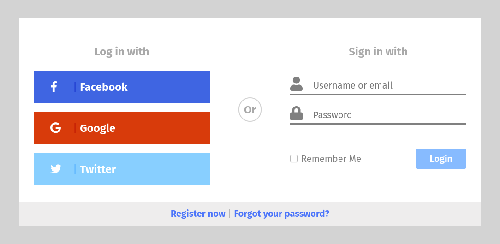

# [DCI Assignment] Login Component

This project is a demonstration of HTML and CSS techniques.

## Task
**Create a login form after an existing design. Be as precise with positioning as possible. Use Font-Awesome for the icons.**

## Topics
- CSS selectors
- layout
- positioning
- responsiveness
- use of dependencies

